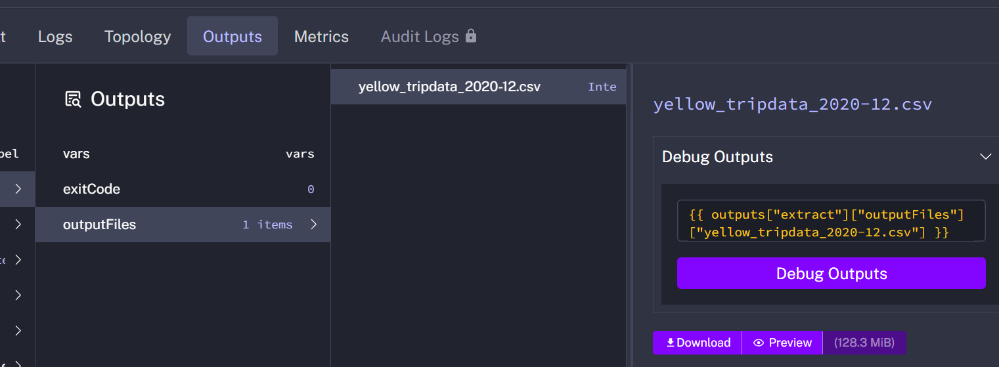

## 1. Within the execution for Yellow Taxi data for the year 2020 and month 12: what is the uncompressed file size (i.e. the output file yellow_tripdata_2020-12.csv of the extract task)?

## 2. What is the rendered value of the variable file when the inputs taxi is set to green, year is set to 2020, and month is set to 04 during execution?
#### Since we defined file: "{{inputs.taxi}}_tripdata_{{inputs.year}}-{{inputs.month}}.csv", so it would track the value of the variable dynamically.

## 3. How many rows are there for the Yellow Taxi data for all CSV files in the year 2020?

## 4. How many rows are there for the Green Taxi data for all CSV files in the year 2020?

## 5. How many rows are there for the Yellow Taxi data for the March 2021 CSV file?
